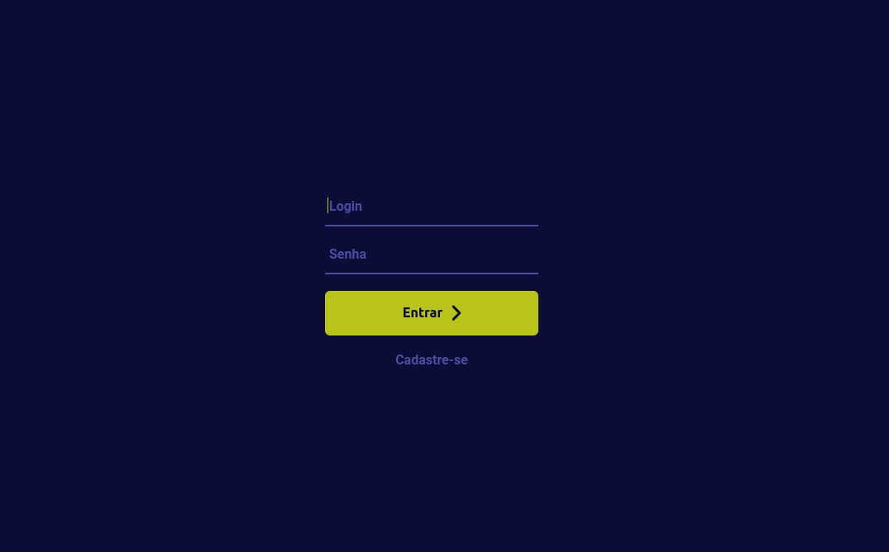
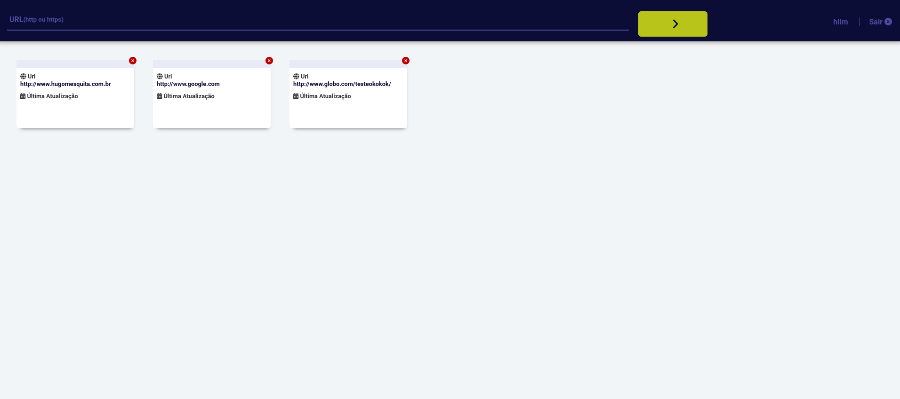
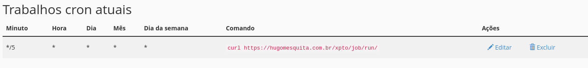

<h1 align="center">Agendador de URL

<h3 align="left">Tela de Login</h3>

  

<h3 align="left">Painel</h3>

  

<h3 align="left">Cron</h3>

  

	
## 💻 Projeto

A Empresa XPTO faz o rastreamento de status de websites. Seus clientes podem acessar a esta aplicação web para cadastrar as URLs que desejam rastrear.

Ao cadastrar uma nova URL o cliente apenas recebe uma confirmação de que a URL foi cadastrada com sucesso, além de poder visualizá-la na sua lista de URLs cadastradas. A cada 1 minuto, o robô desta aplicação (que nada mais é do que um script executado de forma agendada através de cron ou job), irá consultar todas as URLs cadastradas.

O robô irá armazenar o código de status HTTP e o corpo da resposta, de forma que o cliente saiba quando sua URL foi acessada, qual foi o status code retornado, bem c\isualizar o corpo do HTML retornado.

## :rocket: Tecnologias
- [PHP]
- [Codeigniter]
- [jQuery]
- [MySQL]

## 📥 Instalação e execução

Execute crie o banco com o nome xpto e tabelas, procedures, funções e triggers
Instruções do extract ddl sql pode ser visualizado na pasta BD/
Link: [https://github.com/hllmweb/xpto/blob/main/BD/ddl_exec.sql]
